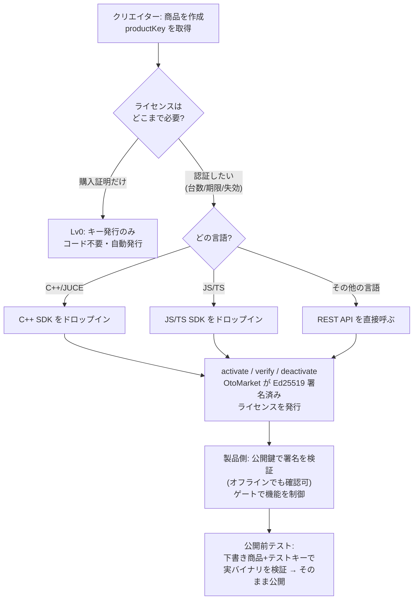

<!-- lang-switch -->
[English](../en/overview.md) · **日本語**

# OtoMarket ライセンス連携の概要

このガイドでは、クリエイターが商品ごとに選べるセルフサービス型のライセンス連携方式を説明します。元になっている設計は
[`docs/license-verification-api-design.md`](../../license-verification-api-design.md)
§2 と §3 です。

> はじめての方は、先に **[用語集](./glossary.md)** をどうぞ。各用語を身近な例で説明しています。

> **AI で組み込む**: 専門知識がなくても、関連ガイド（[SDK 組み込みガイド](./integration.md) または [REST API ガイド](./rest-api.md)）と [SDK README](../../../README.md) を Cursor / Claude / ChatGPT などの AI アシスタントに渡せば、組み込みコードを生成してもらえます。まず[クイックスタート](./quickstart.md)の sandbox キーで疎通を確認してください。

## 全体像（図）

上図の各段は、このあとのガイドに対応します（[クイックスタート](./quickstart.md) → [SDK 組み込み](./integration.md) / [REST API](./rest-api.md) → 公開前テストは組み込みガイド内の「本番内テスト」の章）。用語がわからないときは [用語集](./glossary.md) をどうぞ。

## 全体像（文章で）

OtoMarket は **あなた自身のプラグインやアプリのライセンス基盤**になれます。自前のライセンスサーバを作る必要も、iLok の「税金」を払う必要もありません。自作プラグインに OtoMarket のライセンスを載せる流れは、商品を作る、`productKey` を取得する、そして **SDK をドロップイン（C++/JUCE または JS/TS）**するか、それ以外の言語なら **REST API** を直接呼ぶだけです。

**対応範囲（SDK と API の違い）**

- **SDK は C++/JUCE と JavaScript/TypeScript の2種類が利用できます。** C++/JUCE のドロップイン SDK はプラグイン（VST3/AU/Standalone）向け、JS/TS SDK は JavaScript/TypeScript のアプリ（Node・Electron・Web）向けです。C# SDK は順次追加中です。
- **「ライセンス API（REST/JSON）」は、HTTP を叩けるどの言語でも**使えます。C++/JUCE 以外は SDK 不要で、この API を直接呼べば組み込めます（→ [REST API ガイド](./rest-api.md)）。
- オンライン認証（毎回 API に確認）なら暗号処理は不要です。**オフライン検証**（API が落ちていても署名済みライセンスをローカル確認）をする場合だけ、その言語に **Ed25519 の署名検証**が必要です（ほぼ全ての言語に標準/定番ライブラリがあります）。

**Amplarium のパック**

Amplarium では **ホスト（Amplarium Player）が SDK を一度だけ組み込み、各パックのライセンスをまとめて検証**します。そのため、パック作者がライセンス処理を実装する必要はありません。

## クリエイターが選ぶ方式

商品ごとに、次のクライアント側連携レベルを選べます。バックエンドのライセンスキー、activation API、署名付きライセンストークンはすべてのレベルで同じ基盤を使います。違いは、クリエイターの商品側でどれだけクライアントコードを使うかです。

| レベル | 使う場面 | OtoMarket が提供するもの | 制御内容 |
| --- | --- | --- | --- |
| Lv0 | 購入証明だけが必要なとき。 | OtoMarket ライブラリに表示される購入者向けライセンスキー。 | なし |
| SDK 組み込み | アプリやプラグインでライセンス認証を行いたいとき。 | C++ SDK、`productKey`、署名公開鍵の設定手順（任意で既製の JUCE 認証パネル）。 | 台数、期限、失効 |

## Product Key

`productKey` は商品の公開識別子です。OtoMarket では、これは `Product.id` そのものです。

クリエイターは商品編集画面の **License integration** からコピーできます。`productKey` は、そのライセンスがどの商品に属するかを示すだけなので、配布するアプリに埋め込んでも安全です。認可用の秘密情報ではありません。

## 鍵と秘密情報

クライアント商品では Ed25519 署名公開鍵だけを使います。公開鍵は SDK の `Config.publicKeyPem` に渡します。

次の情報は絶対に表示・配布しないでください。

- `LICENSE_SIGNING_PRIVATE_KEY`
- storage keys や object storage secrets
- Stripe secrets
- R2/S3 credentials

## SDK 配布

C++ SDK は
[`packages/license-sdk-cpp`](../../..) にあります。
[`README.md`](../../../README.md) では、CMake、JUCE アダプタ、埋め込み activation panel、サンプル、テスト、packaging を説明しています。

JavaScript/TypeScript SDK は
[`packages/license-sdk-js`](../../../packages/license-sdk-js)（Node・Electron・Web）にあります。インストールと使い方は [`README.md`](../../../packages/license-sdk-js/README.md) を参照してください。

実際の商品に結線する前に sandbox ライセンスを activation したい場合は、まず [SDK クイックスタート](./quickstart.md) から始めてください。

SDK は一度組み込んだ後でも外せます。コンテンツを暗号化ロックする仕組みではないため、外してもパックは読み込めます（ライセンス確認をしなくなるだけ）。着脱の方法は [SDK 組み込みガイド](./integration.md) の「後から外す・無効化する」を参照してください。

## Sandbox テストキー

development seed は、非公開の sandbox 商品と共有テストライセンスを作成します。

| 名前 | 値 |
| --- | --- |
| `productKey` | `otomarket-sandbox-license-sdk` |
| `licenseKey` | `OTOMARKET-SANDBOX-LICENSE-SDK` |

これらのキーは、ローカル環境やセルフホスト環境での連携テスト専用です。購入証明ではないため、実商品を gate する用途には絶対に使わないでください。hosted staging で activation するには、同じ sandbox 行を staging database に provision しておく必要があります。

ガイド:

- [SDK クイックスタート](./quickstart.md)
- [Lv0: 購入証明](./lv0.md)
- [SDK 組み込みガイド（C++/JUCE）](./integration.md)
- [VST3/AU プラグイン統合ガイド](./plugin.md)
- [REST API ガイド（どの言語でも）](./rest-api.md)
